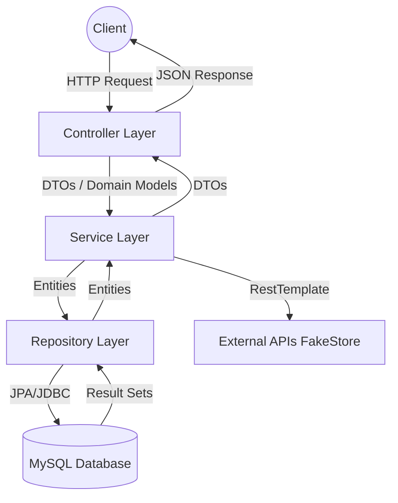
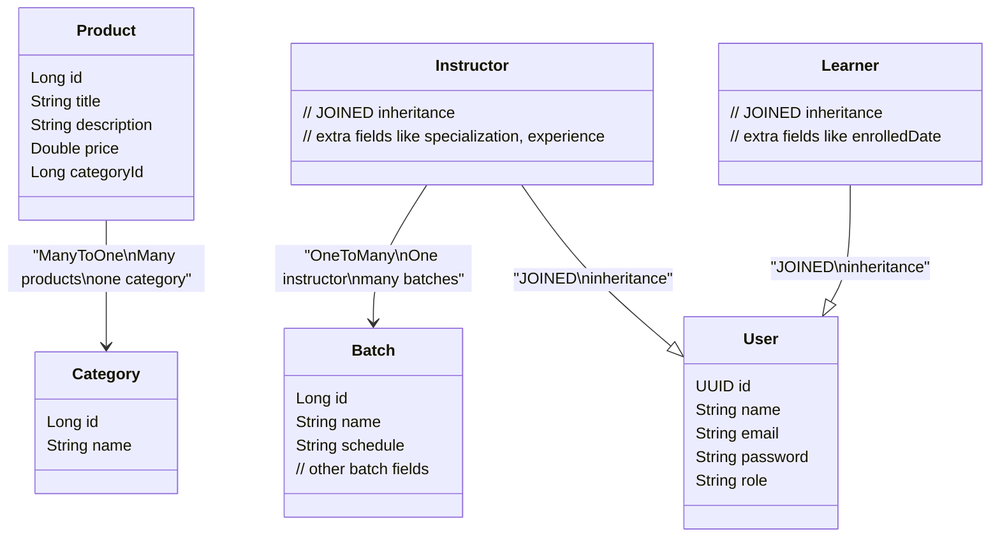
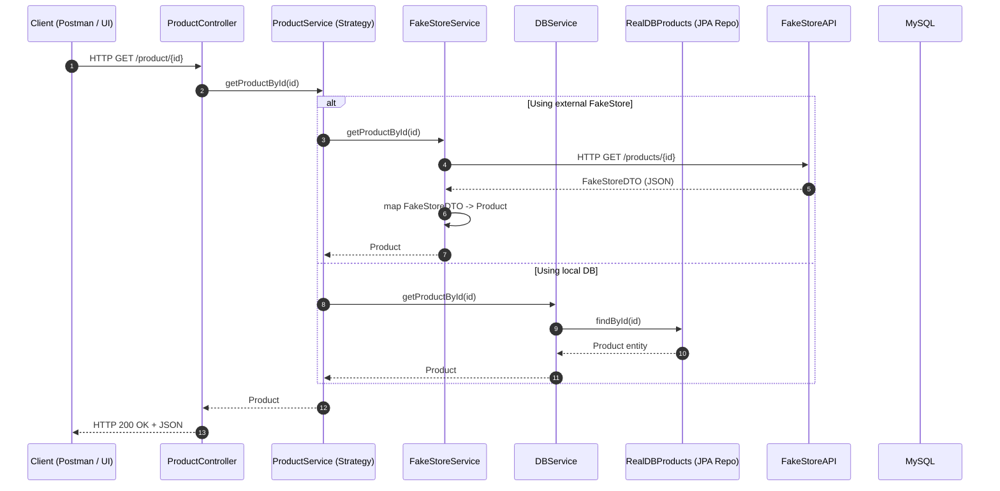
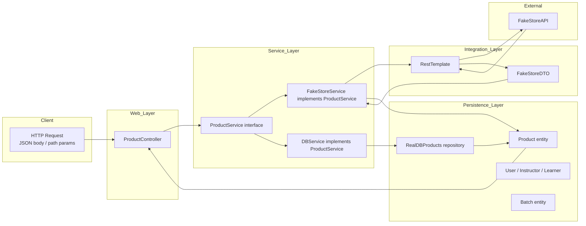
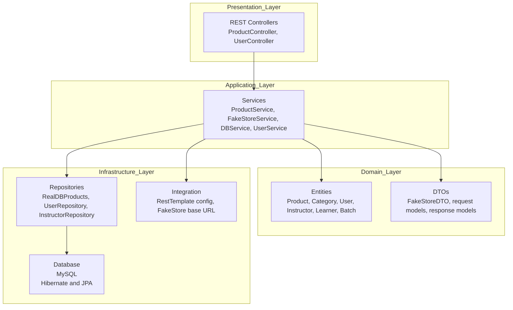
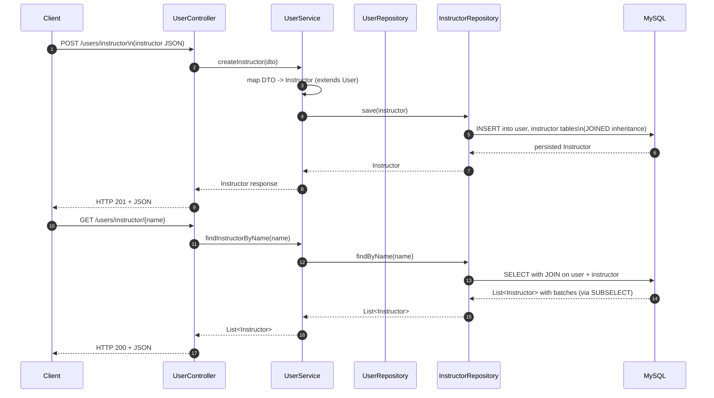

# Interview Preparation Guide: E-commerce & LMS Backend

This project is a Spring Boot-based backend system that demonstrates core concepts of microservices, third-party integrations, and advanced JPA mappings. It serves as an excellent foundation for discussing enterprise-grade development practices.

## 1. Project Overview
- **Core Purpose**: A robust backend for an E-commerce platform (Product Service) with extensions for a Learning Management System (LMS).
- **Technology Stack**:
  - **Framework**: Spring Boot (Java)
  - **Database**: MySQL (Relational)
  - **ORM**: Spring Data JPA / Hibernate
  - **Integration**: RestTemplate for consuming external REST APIs (FakeStoreAPI)
  - **Lombok**: To minimize boilerplate code (Getters, Setters).

## 2. Architecture & MVC Pattern
The application follows a standard **Model-View-Controller (MVC)** architectural pattern, adapted for RESTful APIs (where the "View" is JSON data).

- **Controllers**: Act as the entry points for client requests, validating inputs, and routing to services. (e.g., `ProductController`, `UserController`).
- **Services**: Contain the core business logic, orchestrating calls to repositories and external APIs. (e.g., `FakeStoreService`, `DBService`, `UserService`).
- **Repositories**: Interface with the MySQL database using Spring Data JPA. (e.g., `RealDBProducts`, `UserRepository`, `InstructorRepository`).
- **Models**: Java objects representing database tables and domain entities. (e.g., `Product`, `User`, `Instructor`, `Batch`).



## 3. Key Architectural Highlights (Interview "Wow" Factors)

### A. Polymorphic Service Layer
The project uses an interface-based design for the `ProductService`.
- **Interface**: `ProductService`
- **Implementation**: `FakeStoreService` (integrates with a 3rd party API) and `DBService` (database).
- **Interview Point**: "I used the Strategy Pattern/Dependency Inversion Principle here. This allows the application to switch between a local database and an external vendor (like FakeStoreAPI) without changing the Controller logic. I used `@Qualifier` for explicit bean injection."

### B. Advanced JPA Inheritance Strategy
The `User` entity and its subclasses (`Instructor`, `Learner`) demonstrate sophisticated database modeling.
- **Strategy**: `InheritanceType.JOINED`
- **Why?**: This strategy creates separate tables for each class, maintaining normalized data while allowing polymorphic queries.
- **Interview Point**: "I chose the JOINED inheritance strategy for the User hierarchy to ensure data integrity and avoid nullable columns, which would occur in a SINGLE_TABLE strategy."

### C. Solving the N+1 Problem
In the `Instructor` model, you'll find:
```java
@OneToMany
@Fetch(FetchMode.SUBSELECT)
private List<Batch> batch;
```
- **Interview Point**: "To optimize performance and avoid the N+1 query problem, I used Hibernate's `FetchMode.SUBSELECT`. This allows the system to fetch all related batches in a single second query rather than one query per instructor."

### D. Model Relationships and Cardinality
The application utilizes rich entity relationships:
- **`Product` to `Category`**: `@ManyToOne` - Many products belong to a single category, mapping business relations accurately and efficiently.
- **`Instructor` to `Batch`**: `@OneToMany` - One instructor manages multiple batches.
- **Cascading**: Implemented cascade types (`CascadeType.PERSIST`, `CascadeType.REMOVE`) to manage dependent entities' lifecycles alongside their parents.

### E. External API Integration & DTO Pattern
- **Pattern**: Usage of `FakeStoreDTO` to decouple the external API's schema from the internal domain model (`Product`).
- **Interview Point**: "I implemented the DTO pattern to ensure that changes in the third-party API (FakeStore) don't break our internal business logic. The `FakeStoreService` handles the mapping/transformation layer."

## 4. Available Routes & Server Capabilities

**Server Capabilities**: Provides a robust, standalone REST API exposing synchronous endpoints handling `GET`, `POST`, `PUT`, and `PATCH` methods. It leverages Spring's internal Tomcat server and supports JSON serialization/deserialization seamlessly. The database schema interacts with an actively updated configuration (`ddl-auto=update`) and logs running SQL executions.

### Product Service (`/product`)
- **`GET /product`**: Fetch all products.
- **`GET /product/{id}`**: Fetch details of a specific product.
- **`POST /product`**: Create a new product.
- **`PUT /product/{id}`**: Fully replace an existing product.
- **`PATCH /product/{id}`**: Partially update an existing product (uses robust custom RestTemplate execution internally).

### User / LMS Service (`/users`)
- **`POST /users`**: Create a standard user.
- **`POST /users/instructor`**: Create an instructor profile.
- **`GET /users/{name}`**: Search users by name.
- **`GET /users/instructor/{name}`**: Fetch instructors matching a specific name.
- **`GET /users/instructor`**: Fetch instructors by their UUIDs (passed via Request body).

## 5. Potential Interview Questions

| Question | Recommended Answer |
| :--- | :--- |
| **Why use RestTemplate instead of Feign?** | RestTemplate is standard in Spring and offers granular control. (Optional: Mentioning Feign as a declarative alternative you are aware of). |
| **Why UUID for Users but Long for Products?** | UUIDs provide better security (harder to guess IDs) and are better for distributed systems, while Long/Auto-increment is efficient for internal catalog items. |
| **How do you handle PATCH vs PUT in your service?** | I used the `httpEntityCallback` and `execute` methods in `RestTemplate` to support `PATCH` (partial updates), which `restTemplate.put()` doesn't natively support easily. |
| **What is `spring.jpa.hibernate.ddl-auto=update`?** | It automatically updates the database schema based on the entity changes. In production, I would use a migration tool like Flyway or Liquibase instead. |

## 6. Future Scalability (Roadmap)
If asked "What would you add next?", you can mention:
1. **Redis Caching**: To cache product details and reduce external API calls.
2. **Kafka Integration**: For asynchronous order processing (as mentioned in the HLD).
3. **Security**: Implementing Spring Security with JWT for protected routes.

### Diagramatic representation of models 

Here are detailed Mermaid diagrams based on the project description in `ip.md` (E‑commerce + LMS backend with Spring Boot). 

***

## 1. Model relations (ER-style)




***

## 2. MVC flow (request → response)




***

## 3. Object flow (DTO, entities, external API)




***

## 4. Layered architecture




***

## 5. LMS side: user and batch flow




***
